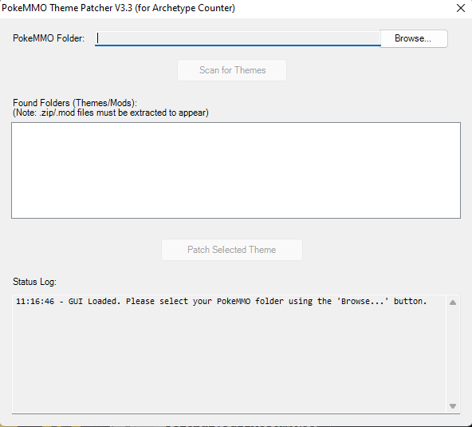

# PokeMMO Archetype Counter Patcher

This tool helps you easily patch your Archetype Counter mod not working/counting. It has a simple graphical interface.

## Quick Download & Use (Recommended)

1.  **Go to Downloads:**
    *   **[➡️ Click here to go to the Releases page and download the Patcher ⬅️](https://github.com/sdinukad/theme-patcher-for-archetype/releases/latest)**
2.  **Download the `.exe`:**
    *   On the Releases page, look for `Archetype Patcher.exe` under "Assets" and download it.
3.  **Run the Patcher:**
    *   Double-click `Archetype Patcher.exe`. No installation needed!
4.  **Using the Patcher:**
    *   **Select PokeMMO Folder:** Click "Browse..." and find your main PokeMMO game folder.
    *   **Scan:** Click "Scan for Themes".
    *   **Choose Theme:** Select a theme from the list.
    *   **Patch:** Click "Patch Selected Theme".
    *   Check the messages in the status log at the bottom for results.

## What This Tool Does

*   Lets you pick your PokeMMO game folder.
*   Finds your installed themes (including the default one).
*   Copies the necessary files from the "Archetype Counter" mod into your chosen theme.
*   Updates the theme's settings file (`theme.xml`) so Archetype Counter shows up correctly.

## Important Notes

*   **You MUST have the "Archetype Counter" mod installed** in your PokeMMO `data/mods/` folder. The patcher needs this mod (specifically a folder named `archetype-counter-main`) to copy files from.
*   If you see any errors, make sure you've selected the correct PokeMMO folder and that the Archetype Counter mod is installed.
*   Sometimes, antivirus programs might flag tools like this. The program is safe; the source code is available in this repository if you're curious.
*   Themes that need to be patched cannot be zip files; they need to be folders.

## For Advanced Users (Source Code)

The PowerShell script (`.ps1`) used to create this tool is available in the `Source Code` folder of this repository. You can inspect it or build the `.exe` yourself if you prefer. Instructions for building are inside the `README_SourceCode.md` file in that folder.

---
